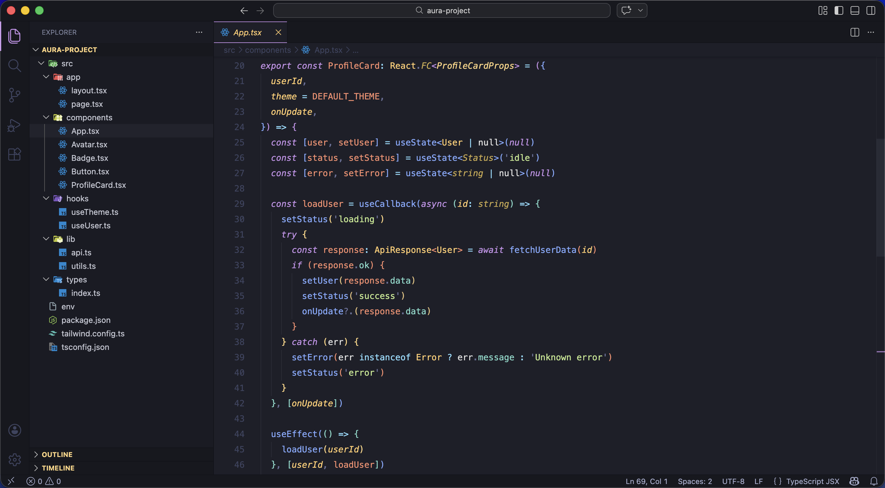
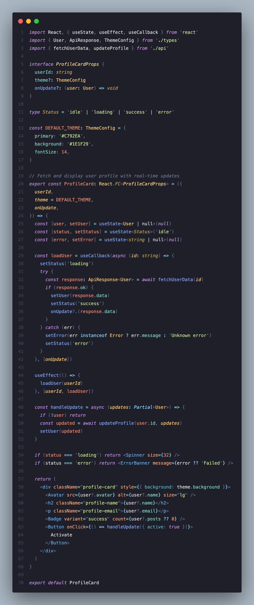
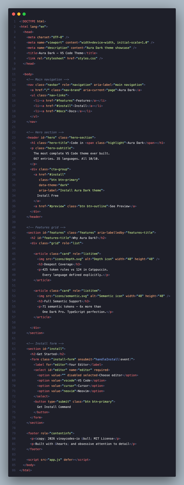
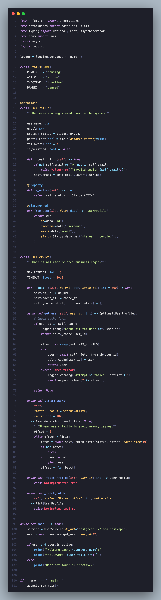

<div align="center">

# Aura Dark

### The most complete VS Code theme ever built.

*Deep purple. Warm. Built for developers who live in their editor.*



[](https://marketplace.visualstudio.com/items?itemName=vinaycodes-io.aura-dark-theme)
[](https://marketplace.visualstudio.com/items?itemName=vinaycodes-io.aura-dark-theme)
[](https://marketplace.visualstudio.com/items?itemName=vinaycodes-io.aura-dark-theme)

</div>

---

## Why Aura Dark?

Every popular theme — One Dark, Catppuccin, Tokyo Night — was built years ago and never fully updated. They use VS Code's fallback system, meaning a Rust struct and a TypeScript interface get the **same color** because nobody defined them separately.

**Aura Dark defines everything explicitly. Every language. Every concept. Every token.**

<div align="center">

| | Aura Dark | Catppuccin | Tokyo Night | One Dark Pro | Dracula |
|---|:---:|:---:|:---:|:---:|:---:|
| **Token Rules** | **425** 🥇 | 124 | 93 | 87 | 71 |
| **Semantic Tokens** | **71** 🥇 | 28 | 22 | 12 | 8 |
| **UI Colors** | **171** 🥇 | 156 | 112 | 78 | 65 |
| **Total Entries** | **667** 🥇 | 308 | 227 | 177 | 144 |
| **Languages** | **35+** 🥇 | 15 | 10 | 8 | 6 |

</div>

---

## Screenshots

### TypeScript & React


### HTML


### Python


---

## Color System

Every color in Aura Dark means something specific. Nothing is random.

<div align="center">

| Color | Hex | Role |
|---|:---:|---|
| 🟣 Purple | `#C792EA` | Keywords · Cursor · Active UI accent |
| 🔵 Periwinkle | `#82AAFF` | Functions · Methods |
| 🔵 Blue | `#61AFEF` | Built-ins · Support functions |
| 🟢 Sage Green | `#C3E88D` | Strings · Template literals |
| 🟡 Warm Gold | `#FFCB6B` | Classes · Types · Active tab |
| 🟡 Amber | `#FFD580` | Interfaces · Decorators · Annotations |
| 🩵 Mint Teal | `#7FDBCA` | Properties · Object keys |
| 🩵 Cyan | `#89DDFF` | Operators · Punctuation |
| 🟠 Peach | `#F78C6C` | Numbers · Constants |
| 🔴 Rose | `#F07178` | HTML tags · Errors |
| 💜 Violet | `#9B8FEF` | CSS pseudo-classes · Regex |
| ⬛ Slate | `#6B7A99` | Comments |

</div>

---

## Background

```
#1E1F29  —  warm purple-dark
```

Not cold grey like One Dark `#282C34`.
Not pure navy like Night Owl `#011627`.

A warm purple-tinted dark that feels native after 6 hours of coding.
Your eyes don't have to constantly adjust between warm code colors
and a cold background — everything belongs together.

---

## Languages (35+)

<details>
<summary><b>Frontend</b></summary>

- **TypeScript** — 23 rules · interfaces, generics, async/await, decorators all distinct
- **JavaScript** — full coverage including modern ES2024 syntax
- **React JSX/TSX** — component names, props, events, expressions all colored
- **HTML** — 29 rules · best HTML coverage of any theme. Tags, attributes, aria, events, entities all distinct
- **CSS / SCSS** — 16 rules · selectors, variables, pseudo-classes, animations
- **Vue** — template directives, v-bind, v-model, composition API
- **Svelte** — {#if}, {#each}, reactive $:, bind: directives
- **GraphQL** — queries, mutations, fragments, types
- **MDX** — markdown + JSX combined
- **Astro** — frontmatter, components, expressions

</details>

<details>
<summary><b>Backend</b></summary>

- **Python** — classes, decorators, type hints, async, self, dataclasses
- **Java** — generics, annotations, lambda, extends/implements
- **Go** — structs, interfaces, channels, defer/panic/recover
- **Rust** — lifetimes, traits, match arms, attributes, ownership
- **PHP** — namespaces, traits, heredoc, null coalescing
- **C#** — LINQ, async/await, generics, null-conditional
- **Kotlin** — coroutines, data classes, null safety, when expressions
- **Swift** — protocols, optionals, property wrappers, guard/defer
- **Ruby** — symbols, mixins, instance variables, heredoc
- **Dart / Flutter** — widgets, mixins, null safety, async
- **Scala** — traits, case classes, pattern matching, implicits
- **R** — pipe operators, assignment, built-in functions
- **Zig** — comptime, error unions, @builtins
- **Lua** — tables, metatables, coroutines
- **C / C++** — templates, namespaces, pointers, cast operators

</details>

<details>
<summary><b>Data & DevOps</b></summary>

- **SQL** — keywords, functions, aliases, operators all distinct
- **Prisma** — model blocks, @attributes, field modifiers
- **Docker** — FROM/RUN/COPY, image tags, ARG/ENV variables, ports
- **Terraform HCL** — resource blocks, variables, interpolation
- **Shell / Bash** — shebang, arrays, flags, case statements, special vars
- **YAML / JSON / TOML** — keys vs values vs booleans all distinct
- **.env files** — keys, values, interpolation, comments
- **Solidity** — contracts, mappings, events, msg.sender
- **GLSL / WGSL** — uniforms, built-in types, vector math
- **Markdown** — headings, bold, italic, code, links, blockquotes
- **Git Diff** — added/removed/header lines in semantic colors
- **Regex** — groups, quantifiers, character classes, anchors

</details>

---

## Semantic Highlighting

Aura Dark ships with **71 semantic token rules** — more than any other theme.

Make sure this is enabled for the best TypeScript and JavaScript experience:

```json
"editor.semanticHighlighting.enabled": true
```

This is what makes function parameters distinct from variables, class properties distinct from local variables, and comments render correctly even in complex files.

---

## Recommended Settings

Pair Aura Dark with these settings for the ultimate experience:

```json
{
  "editor.fontFamily": "JetBrains Mono, Fira Code, monospace",
  "editor.fontSize": 14,
  "editor.lineHeight": 1.75,
  "editor.fontLigatures": true,
  "editor.cursorStyle": "line-thin",
  "editor.cursorBlinking": "expand",
  "editor.smoothScrolling": true,
  "editor.bracketPairColorization.enabled": true,
  "editor.guides.bracketPairs": true,
  "editor.minimap.enabled": false,
  "editor.formatOnSave": true,
  "workbench.iconTheme": "material-icon-theme",
  "editor.semanticHighlighting.enabled": true
}
```

> **Font recommendation:** [JetBrains Mono](https://www.jetbrains.com/lp/mono/) — free, ligatures included, designed specifically for code.

---

## Installation

**Via VS Code:**
1. Open Extensions panel `Ctrl+Shift+X` / `Cmd+Shift+X`
2. Search **Aura Dark**
3. Click Install
4. Press `Ctrl+K Ctrl+T` / `Cmd+K Cmd+T` → select **Aura Dark**

**Via Quick Open:**
1. Press `Ctrl+P` / `Cmd+P`
2. Run `ext install vinaycodes-io.aura-dark-theme`

---

## Eye Comfort

Aura Dark was designed for long sessions.

- **Warm background** `#1E1F29` — reduces blue light exposure vs cold grey themes
- **Calibrated contrast** — all colors pass 3:1 minimum, most pass 4.5:1
- **Intentionally dim comments** — `#6B7A99` at 3.79:1 — readable but not distracting
- **No pure white** — brightest text is `#E0E0E0` — easier on eyes after hour 4

---

## Feedback & Issues

Found a language that looks off? Have a suggestion?

👉 [Open an issue on GitHub](https://github.com/vinaycodes-io/aura-dark-theme/issues)

Every report gets a response. Language coverage improvements ship fast.

---

## License

MIT — free to use, modify, and share.

---

<div align="center">

*Built with obsessive attention to detail.*
*Every color is intentional. Every language is covered.*

**[Install Aura Dark](https://marketplace.visualstudio.com/items?itemName=vinaycodes-io.aura-dark-theme)**

</div>
